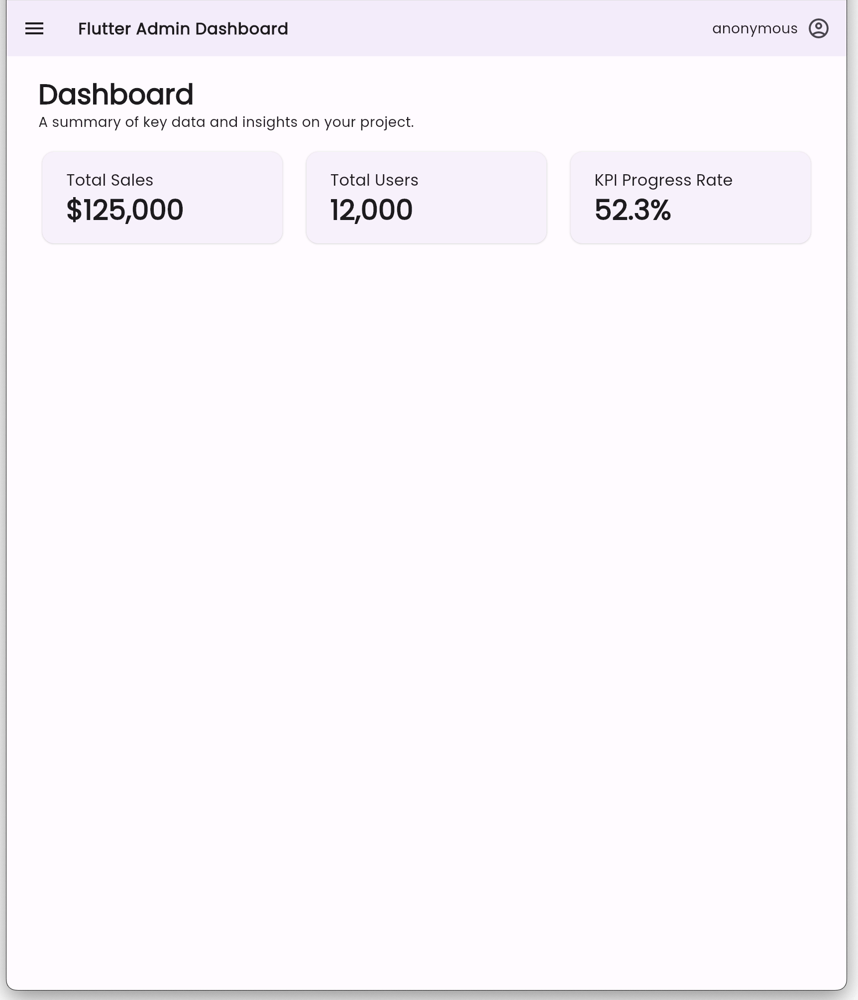

# Flutter Admin Dashboard Template

This is an admin dashboard template for Flutter Web.

**[View Demo](https://flutter-admin-dashboard-d5aeb.web.app/)**

## Features

- Material Design 3
- Light/Dark mode
- Declarative routing by using [go_router_builder](https://pub.dev/packages/go_router_builder)
- Responsive layout

| Light | Dark |
| --- | --- |
|  |  |

| Tablet | Drawer | Mobile |
| --- | --- | --- |
|  |  |  |

## Usage

This is a template repository. You can create new your repository by `Use this template` > `create a new repository` as following capture.

